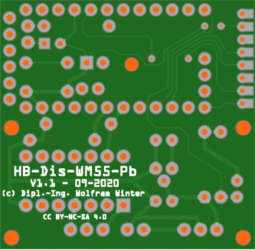

# WW-myPCB - HB-Dis-WM55-Pb

[Zurück zur Übersicht ... ](../README.md)

### Beschreibung
Platine für die Erweiterung der Homematic 'Funk-Statusanzeige HM-Dis-WM55' zur externen zusätzlichen Ansteuerung der Anzeige-Tasten. Eine Einbau- bzw. Montagemöglichkeit kann über vier 2 mm Platinen-Löcher realisiert werden.

### Platine
- Version 1.0 - für 'Asksin++'' Aufsatzplatine ['HB-UNI-Mini-X'](https://github.com/wolwin/WW-myPCB/blob/master/PCB_HB-UNI-Mini-X/README.md) oder ['HB-UNI-Mini'](https://github.com/ronnythomas/HB-Mini)
  - Maße: 31 x 39 mm
  - Oberseite:
      
    
      
  - Unterseite:
      
    
      
- Version 1.1 - mit integriertem 'Asksin++'' Modul
  - Maße: 40 x 39 mm
  - Oberseite:
      
    
      
  - Unterseite:
      
    
  

### Gerber-Dateien
[Download 'HB-Dis-WM55-Pb - Version 1.0' ...](./bin/Gerber_HB-Dis-WM55-Pb_1.0.zip)
 
[Download 'HB-Dis-WM55-Pb - Version 1.1' ...](./bin/Gerber_HB-Dis-WM55-Pb_1.1.zip)

### Schaltplan
[Zeigen 'HB-Dis-WM55-Pb - 1.0' ...](./bin/HB-Dis-WM55-Pb_1.0.pdf)
 
[Zeigen 'HB-Dis-WM55-Pb - 1.0 - Verdrahtung' ...](./bin/HB-Dis-WM55-Pb_1.0_Verdrahtung.pdf)
 
[Zeigen 'HB-Dis-WM55-Pb - 1.1' ...](./bin/HB-Dis-WM55-Pb_1.1.pdf)
 
[Zeigen 'HB-Dis-WM55-Pb - 1.1 - Verdrahtung' ...](./bin/HB-Dis-WM55-Pb_1.1_Verdrahtung.pdf)

### Teileliste
[Zeigen 'HB-Dis-WM55-Pb - 1.0 - Teileliste' ...](./bin/HB-Dis-WM55-Pb_1.0_Teileliste.txt)
 
[Zeigen 'HB-Dis-WM55-Pb - 1.1 - Teileliste' ...](./bin/HB-Dis-WM55-Pb_1.1_Teileliste.txt)

### Aufbau
- Bestückung der Platine entsprechend der Teileliste.
- Detaillierte Konfigurationsmöglichkeiten siehe hier:
    - Projekt 'SHP_HB-Dis-WM55-Pb' - [Zeigen ...](https://github.com/wolwin/WW-mySHP/blob/master/SHP_HB-Dis-WM55-Pb/README.md)

### Bilder
- Übersicht - 'HB-Dis-WM55-Pb'   

  

### Historie
- 2020-10-07 - Erstveröffentlichung
  - Version 1.0 - 09-2020
  - Version 1.1 - 09-2020
