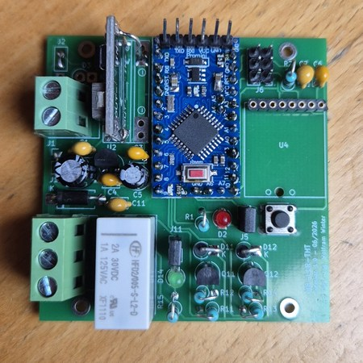
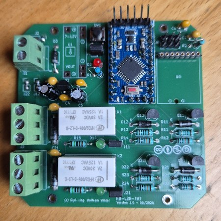

# WW-myPCB - HB-LxR-THT – 'AskSin++' Platinen mit bistabilen Relais (THT)

[Zurück zur Übersicht ...](../README.md)

### Beschreibung
Die Platinen **HB-L1R-THT** und **HB-L2R-THT** sind Relaismodule auf Basis eines **Arduino Pro Mini 3,3 V (ATmega328P)** und eines **CC1101-Funkmoduls**. Die Schaltung ist für den Einsatz im **Homematic-/ASKSIN-Umfeld** konzipiert und verwendet ausschließlich **THT-Bauteile**, wodurch sie sich besonders gut für den Eigenbau eignet.

Der einzige Unterschied zwischen den beiden Versionen besteht in der Anzahl der Schaltkanäle:

* **HB-L1R-THT:** &nbsp;&nbsp;&nbsp;1 Relaiskanal
* **HB-L2R-THT:** &nbsp;&nbsp;&nbsp;2 Relaiskanäle

Alle übrigen Schaltungsteile, die Spannungsversorgung, die Relaisansteuerung, die Tastereingänge sowie die Programmier- und Kommunikationsschnittstellen sind identisch aufgebaut. Jeder Relaiskanal verwendet ein **bistabiles DPDT-Relais Hongfa HFD2/005-S-L2-D**. Bistabile Relais benötigen nur während des Schaltvorgangs einen kurzen Stromimpuls und verbrauchen im eingeschalteten Zustand keine Halteleistung.

Weitere **wichtige Schaltungsdetails** &nbsp;&nbsp;[... finden sich hier ...](README_LxR.md "Schaltungsdetails")

### Platinen
- **HB-L1R-THT:**
  - Version 1.0 &nbsp;&nbsp;&nbsp;&nbsp;[Zeige Platine 'HB-L1R-THT - V 1.0' ...](README_L1R_10.md "Platine HB-L1R-THT - Version 1.0")
  - Version 1.1 &nbsp;&nbsp;&nbsp;&nbsp;[Zeige Platine 'HB-L1R-THT - V 1.1' ...](README_L1R_11.md "Platine HB-L1R-THT - Version 1.1")

- **HB-L2R-THT:**
  - Version 1.0 &nbsp;&nbsp;&nbsp;&nbsp;[Zeige Platine 'HB-L2R-THT - V 1.0' ...](README_L2R_10.md "Platine HB-L2R-THT - Version 1.0")
  - Version 1.1 &nbsp;&nbsp;&nbsp;&nbsp;[Zeige Platine 'HB-L2R-THT - V 1.1' ...](README_L2R_11.md "Platine HB-L2R-THT - Version 1.1")

### Gerber-Dateien
- **HB-L1R-THT:**
  - Version 1.0 &nbsp;&nbsp;&nbsp;&nbsp;[Download 'HB-L1R-THT - V 1.0' ...](./bin/HB-L1R-THT/Gerber_HB-L1R-THT_01_1.0.zip "Gerber HB-L1R-THT - V 1.0")
  - Version 1.1 &nbsp;&nbsp;&nbsp;&nbsp;[Download 'HB-L1R-THT - V 1.1' ...](./bin/HB-L1R-THT/Gerber_HB-L1R-THT_02_1.1.zip "Gerber HB-L1R-THT - V 1.1")
- **HB-L2R-THT:**
  - Version 1.0 &nbsp;&nbsp;&nbsp;&nbsp;[Download 'HB-L2R-THT - V 1.0' ...](./bin/HB-L2R-THT/Gerber_HB-L2R-THT_01_1.0.zip "Gerber HB-L2R-THT - V 1.0")
  - Version 1.1 &nbsp;&nbsp;&nbsp;&nbsp;[Download 'HB-L2R-THT - V 1.1' ...](./bin/HB-L2R-THT/Gerber_HB-L2R-THT_02_1.1.zip "Gerber HB-L2R-THT - V 1.1")

### Schaltplan
- **HB-L1R-THT:**
  - Version 1.0 &nbsp;&nbsp;&nbsp;&nbsp;[Zeige 'HB-L1R-THT - V 1.0' ...](./bin/HB-L1R-THT/Schaltplan_HB-L1R-THT_1.0.pdf "Schaltplan HB-L1R-THT - V 1.0")
  - Version 1.1 &nbsp;&nbsp;&nbsp;&nbsp;[Zeige 'HB-L1R-THT - V 1.1' ...](./bin/HB-L1R-THT/Schaltplan_HB-L1R-THT_1.1.pdf "Schaltplan HB-L1R-THT - V 1.1")
- **HB-L2R-THT:**
  - Version 1.0 &nbsp;&nbsp;&nbsp;&nbsp;[Zeige 'HB-L2R-THT - V 1.0' ...](./bin/HB-L2R-THT/Schaltplan_HB-L2R-THT_1.0.pdf "Schaltplan HB-L1R-THT - V 1.0")
  - Version 1.1 &nbsp;&nbsp;&nbsp;&nbsp;[Zeige 'HB-L2R-THT - V 1.1' ...](./bin/HB-L2R-THT/Schaltplan_HB-L2R-THT_1.1.pdf "Schaltplan HB-L1R-THT - V 1.1")

### Teileliste
- **HB-L1R-THT:**
  - Version 1.0 &nbsp;&nbsp;&nbsp;&nbsp;[Zeige 'HB-L1R-THT - V 1.0' ...](./bin/HB-L1R-THT/Teileliste_HB-L1R-THT_1.0.txt "Teileliste HB-L1R-THT - V 1.0")
  - Version 1.1 &nbsp;&nbsp;&nbsp;&nbsp;[Zeige 'HB-L1R-THT - V 1.1' ...](./bin/HB-L1R-THT/Teileliste_HB-L1R-THT_1.1.txt "Teileliste HB-L1R-THT - V 1.1")
- **HB-L2R-THT:**
  - Version 1.0 &nbsp;&nbsp;&nbsp;&nbsp;[Zeige 'HB-L2R-THT - V 1.0' ...](./bin/HB-L2R-THT/Teileliste_HB-L2R-THT_1.0.txt "Teileliste HB-L1R-THT - V 1.0")
  - Version 1.1 &nbsp;&nbsp;&nbsp;&nbsp;[Zeige 'HB-L2R-THT - V 1.1' ...](./bin/HB-L2R-THT/Teileliste_HB-L2R-THT_1.1.txt "Teileliste HB-L1R-THT - V 1.1")

### Aufbau
- Bestückung der Platine entsprechend der Teileliste.
- Detaillierte Infos mit zugehöriger 'AskSin++'-Firmware siehe hier:
  - Projekt **'HB-LxR-THT – 'AskSin++' Platinen mit bistabilen Relais (THT)'** - [Zeigen ...](https://github.com/wolwin/WW-mySHP/blob/master/SHP_HB-LxR-THT/README.md)

### Bilder
- HB-L1R-THT - V 1.0 - 12 Volt  

  
- HB-L2R-THT - V 1.0 - 5 Volt  

### Historie
- 2026-08-06 - Erstveröffentlichung
  - Version 1.1 - 08-2026
