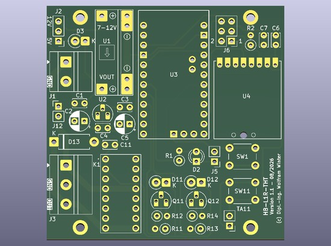
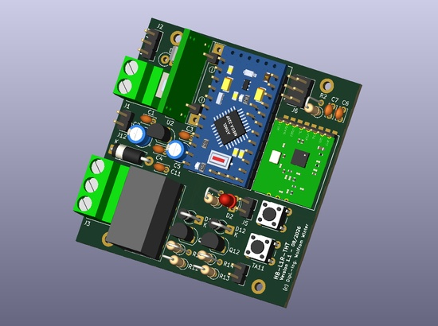
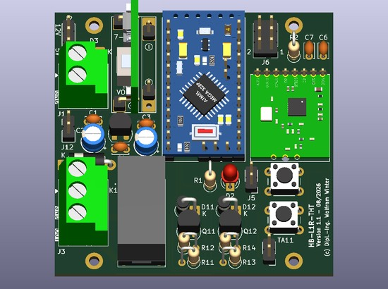
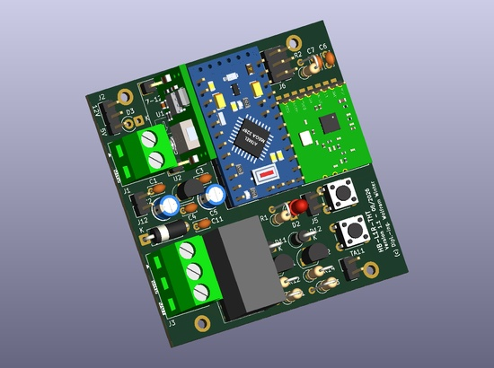

# WW-myPCB - HB-L1R-THT – Version 1.1

[Zurück zu 'HB-LxR-THT' ...](README.md)

### Platine
- **HB-L1R-THT - Version 1.1**
- Maße: 60 x 60 mm
- Lochabstand: 43 x 54 mm - Bohrung: 2,2 mm
    
  
    
- Bestückung für 12V Version:
    
  
  
  
