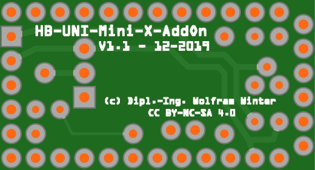

# WW-myPCB - HB-UNI-Mini-X-AddOn

[Zurück zur Übersicht ...](../README.md)

#### Beschreibung

xxx

#### Platine
- Version: 1.1
- Maße: 33 x 18 mm
- Oberseite:
    

  
- Unterseite:
    

  

#### Gerber-Dateien
[Download ...](./bin/Gerber_HB-UNI-Mini-X-AddOn_1.1.zip)

#### Teileliste
[Zeigen ...](./bin/HB-UNI-Mini-X-AddOn_1.1_Teileliste.txt)

#### Schaltplan
[Zeigen ...](./bin/HB-UNI-Mini-X-AddOn_1.1.pdf)

#### Bilder

#### Historie
1.1 - 12-2019
 
\- Erstveröffentlichung
