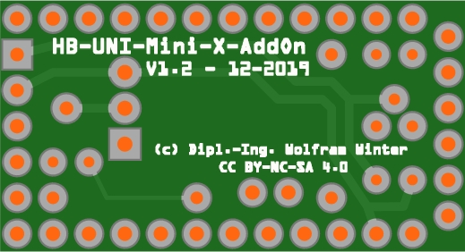
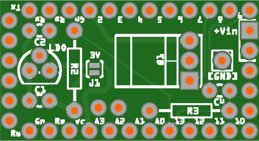
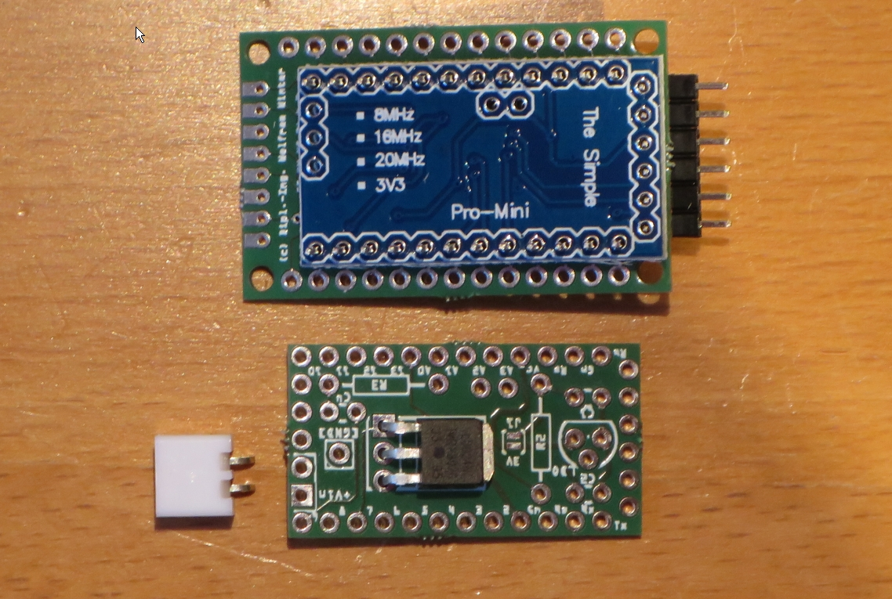
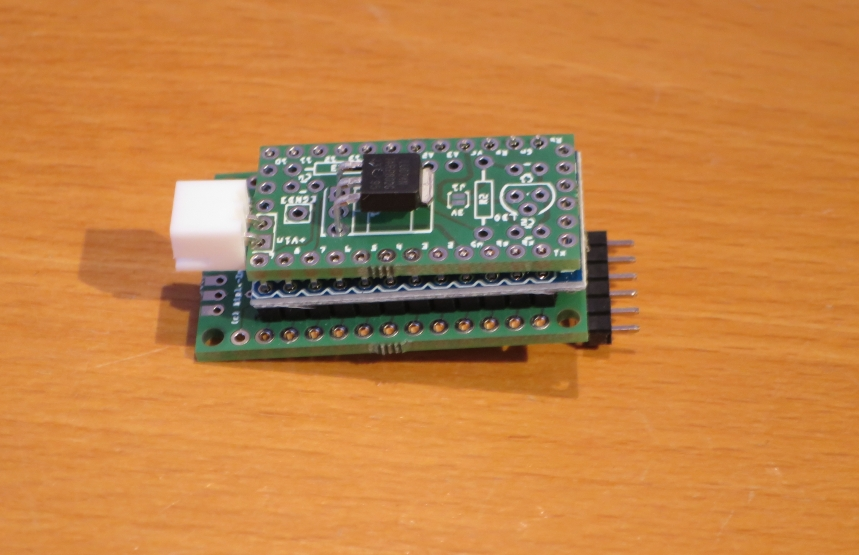
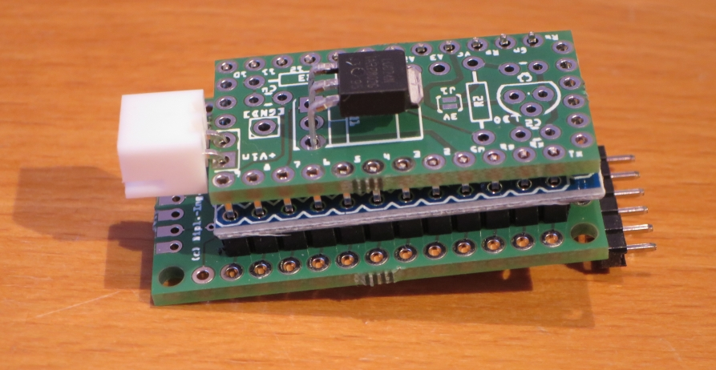

# WW-myPCB - HB-UNI-Mini-X-AddOn

[Zurück zur Übersicht ...](../README.md)

#### Beschreibung

AddOn Platine für 'HB-UNI-Mini-X' im THT-Format. Mit 'HB-UNI-Mini-X' und dem 'HB-UNI-Mini-X-AddOn' kann die Kern-Funktionalität der 'HB-UNI-Sens-X' Platine erreicht werden.

#### Platine
- Version: 1.2
- Maße: 33 x 18 mm
- Oberseite:
    

  
- Unterseite:
    

  

#### Gerber-Dateien
[Download ...](./bin/Gerber_HB-UNI-Mini-X-AddOn_1.2.zip)

#### Schaltplan
[Zeigen ...](./bin/HB-UNI-Mini-X-AddOn_1.2.pdf)

#### Teileliste
[Zeigen ...](./bin/HB-UNI-Mini-X-AddOn_1.2_Teileliste.txt)

#### Aufbau
- Bestückung der Platine entsprechend der Teileliste:
  - Nach der Bestückung wird die AddOn-Platine von unten auf die zwei Stiftleisten des Arduino gesetzt (siehe Zusammenbau-Variante 1 des 'HB-UNI-Mini-X') und verlötet - d.h.: die Lötseiten der beiden Platinen stehen gegeneinander (identische Pinbezeichnungen!!). Weiter ist auf ausreichenden Abstand der beiden Platinen zueinander zu achten.
  - Es ist auch möglich die Zusammenbau-Variante 2 des 'HB-UNI-Mini-X' mit dem AddOn-Modul zu versehen: dazu erfolgt die AddOn Bestückung auf der Oberseite der Platine (Achtung bei Bestückung: LDO und Mosfet sind gedreht!!).
  
- Spannungsversorgung für 'HB-UNI-Mini-X'- und 'HB-UNI-Mini-X-AddOn'-Modul über 'Vin'-Anschluß
  - 3 - 3.3 V (max)
    - LDO, C1 und C2 werden <u>nicht</u> bestückt
    - Jumper J1 (geschlossen) mit Lötbrücke auf '3V' setzen
  - optional 4 - 9 V (max. 12 V)
    - LDO, C1 und C2 werden bestückt
    - Jumper J1 (offen) keine Lötbrücke setzen
  - bei der Benutzung des MCP1702 max. 250mA für alle angeschlossenen Platinen und Elemente
  - evtl. Spannungsstabilisierung auf der 'HB-UNI-Mini-X' Platine (dort: optionale Bestückung von C1)
  
- Optionale Komponenten = zusätzliche Bestückung:
  - Spannungsüberwachung per INO-Script
    - Bestückung mit C4, R2 und R3
    - Details dazu auf der 'Github TomMajor' Side - [Zeigen ...](https://github.com/TomMajor/SmartHome/tree/master/HB-UNI-Sensor1#messung-der-batteriespannung)
  - GND-Schaltung (An/Aus) z.B. von I2C-, 1-Wire- oder anderen Komponneten mit GND-Anschluß am Pin-Ausgang [GND]
    - Bestückung mit Q1

#### Bilder
- Übersicht - 'HB-UNI-Mini-X-AddOn' mit 'HB-UNI-Mini-X' (Variante 1 - default)  

#### Historie
- 2020-01-10 - Erstveröffentlichung
  - Version 1.2 - 12-2019
