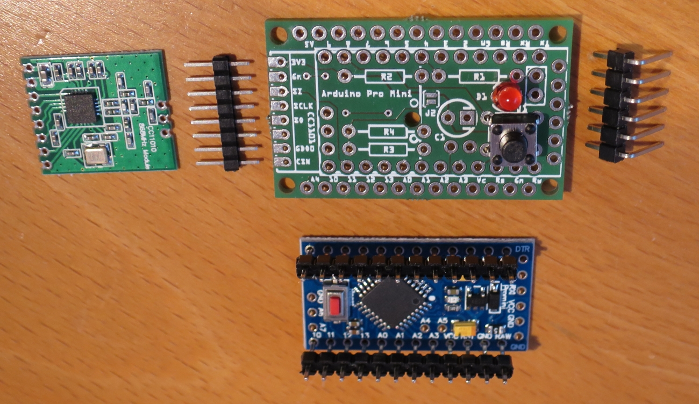
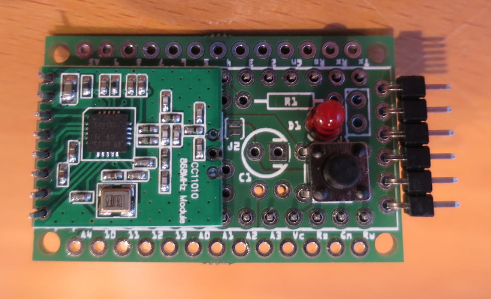
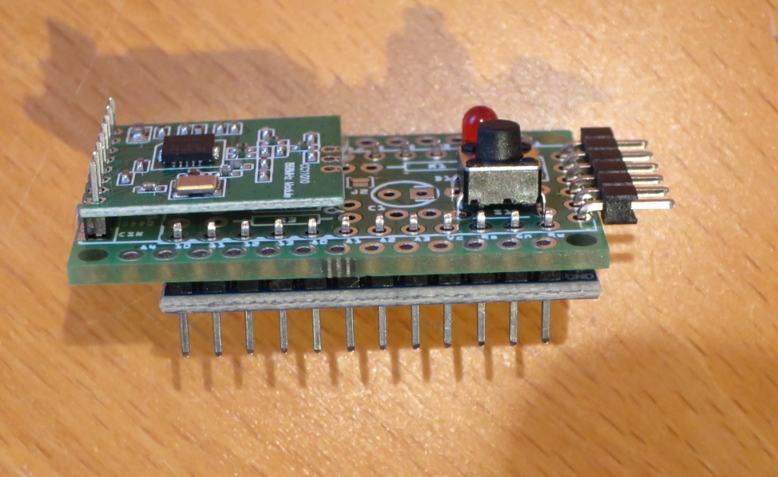
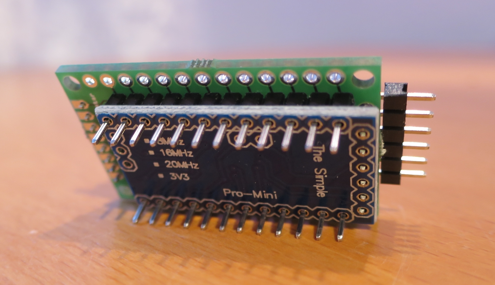
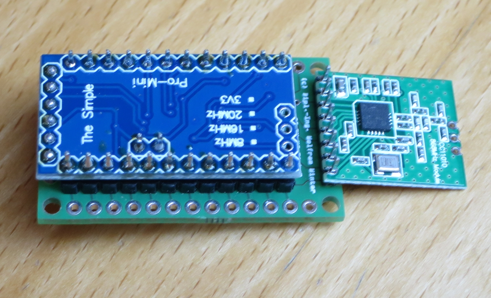
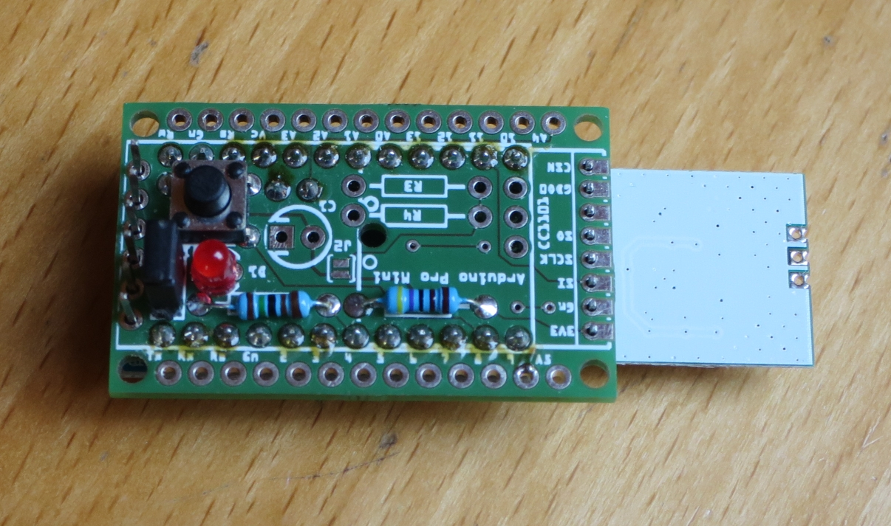
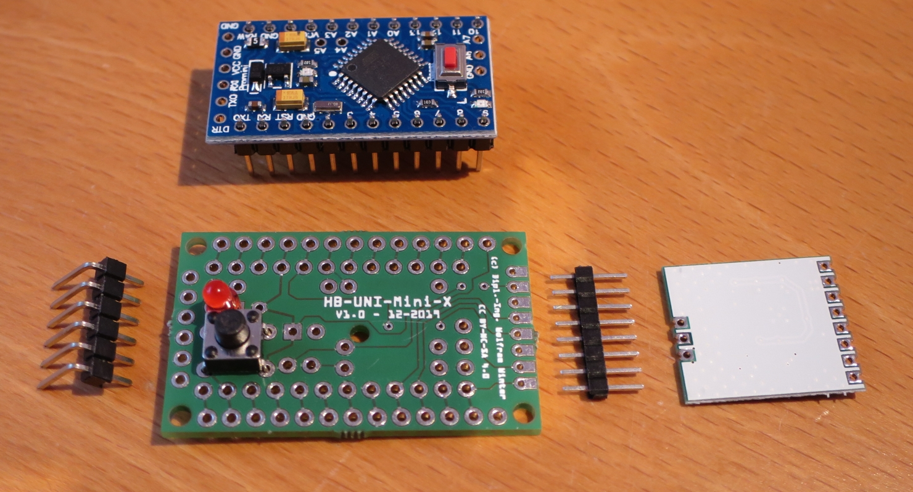
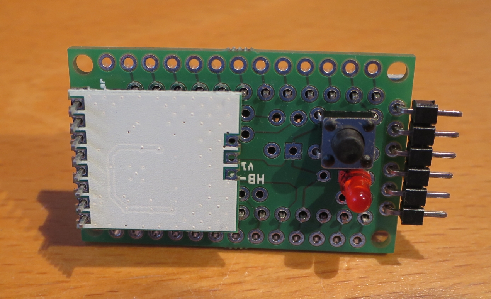
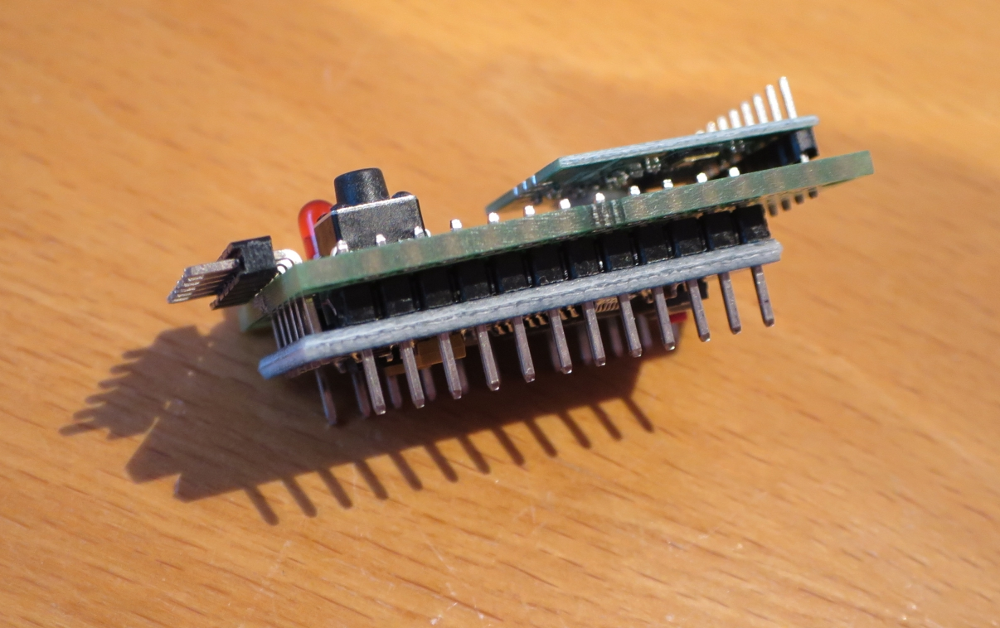
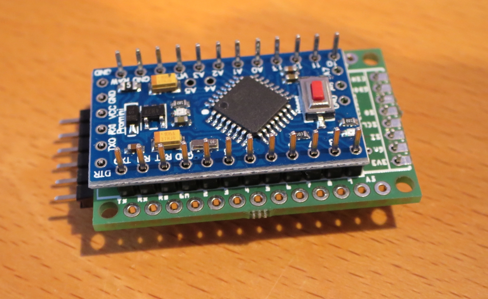

# WW-myPCB - HB-UNI-Mini-X

[Zurück zur Übersicht ...](../README.md)

#### Beschreibung

Universielle 'AskSin++' Mini-Platine im THT-Format. Es sind alle Ports des 'Arduino Pro Mini' über zwei beschriftete Port Reihen (bestückbar mit Pin-Header oder JST-XH) zugänglich. Optionale Pullup Widerstände für I2C und 1-Wire Anschluß können verbaut werden. Eine Einbau- bzw. Montagemöglichkeit kann über vier 2 mm Platinen-Löcher realisiert werden.

#### Platine
- Version: 1.0
- Maße: 40 x 25 mm
- Oberseite:
    

  
- Unterseite:
    

  

#### Gerber-Dateien
[Download ...](./bin/Gerber_HB-UNI-Mini-X_1.0.zip)

#### Schaltplan
[Zeigen ...](./bin/HB-UNI-Mini-X_1.0.pdf)

#### Teileliste
[Zeigen ...](./bin/HB-UNI-Mini-X_1.0_Teileliste.txt)

#### Aufbau
- Bestückung der Platine entsprechend der Teileliste:
  - Zuerst die diskreten Bauelemente, dann der vorbereitete 'Arduino Pro Mini' (siehe unten - Funktionstest vor dem Einlöten durchführen) und zuletzt das Sendemodul CC1101.
  - In der Regel wird die Platine mit zwei Stiftleisten von oben auf den Arduino gesetzt (vor dem Zusammenlöten darauf achten, daß der Reset-Knopf des Arduino nicht gedrückt wird und keine Verbindungskontakte über die Bauteilelötung erfolgt) - auf die Platine kommt dann wiederum das Sendemodul ( => Variante 1).
  - das Sendemodul CC1101 wird über eine Stiftleiste oder eine Sockelleiste oberhalb angeordnet - dabei gibt es zwei Möglichkeiten:
      - kompakt: Sendemodul C1101 liegt über dem Platinenträger / 'Arduino Pro Mini' (Antennenfuß im Bereich des AVR)
      - abseits (default): Sendemodul C1101 komplett außerhalb des Platinenträgers
    - alternativ kann das Sendemodul auch gedreht (mit der Rückseite nach oben) direkt auf die Trägerplatine gelötet werden - dabei ragt es seitlich über den Träger hinaus
  - Es ist auch möglich den Arduino von oben auf die Platine zu setzen - dabei werden dann S1, D1 und J1 von unten auf die Platine gelötet ( => Variante 2).
    - auch hier wird das Sendemodul CC1101 wie in der Variante 1 verbaut
  - minimale Bauhöhe ca. 15 mm
  
- Optionale Komponenten = zusätzliche Bestückung:
  - Status-LED
    - Bestückung mit D1, R1 und Jumper J1 - um Strom zu sparen, kann der Jumper nach dem 'Anlernen' für die 'Produktion' entfernt werden.
  - Anschluß von 1-Wire Komponenten
    - Bestückung mit R2
  - Anschluß von I2C Komponenten, die Pullup Widerstände benötigen
    - Bestückung mit R3, R4 und Löt-Jumper J2 (gesetzt)
  - Spannungsstabilisierung
    - Bestückung mit C1
  
- Vorbereitung des 'Arduino Pro Mini':
    - Hardware
      - Bei Batteriebetrieb müssen zur Minimierung des Ruhestroms auf dem 'Arduino Pro Mini' Board der LDO Spannungsregler und die <u>drei</u> Signal-LEDs ausgelötet werden.
      - Details dazu auf der 'AskSin++' Side - [Zeigen ...](https://asksinpp.de/Grundlagen/01_hardware.html#batteriebetrieb)
        - Anmerkung: die *dritte* Signal-LED befindet sich unten rechts auf der Platine - siehe [-5-]
    - Software
      - Aufspielen des Bootloaders und Setzen der Fuse-Bits
      - Details dazu auf der 'AskSin++' Side - [Zeigen ...](https://asksinpp.de/Grundlagen/FAQ/babbling_idiot.html#anschluss-des-isp)
      -  Aufspielen des INO-Scripts und Test
      
    - Gemessener Ruhestrom ohne externe Komponenten
      - mit 2 AA Batterien (=3.2V) < 7uA
      - mit 3 AA Batterien (=4.8V) <= 7uA

#### Bilder
- Übersicht - Variante 1 - Sende-Modul kompakt angeordnet  

- Übersicht - Variante 1 - Sende-Modul abseits angeordnet (Default)  

- Übersicht - Variante 2 - Sende-Modul kompakt angeordnet  

#### Historie
- 2021-03-03 - Erläuterung Anordnung Sendemodul C1101
- 2020-01-10 - Erstveröffentlichung
  - Version 1.0 - 12-2019
