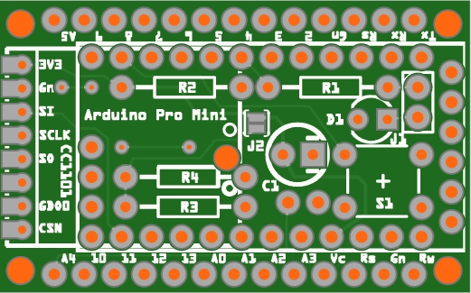
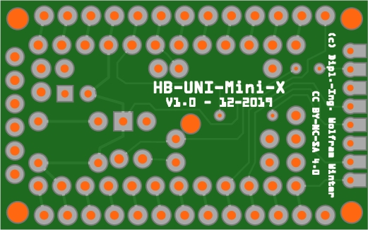
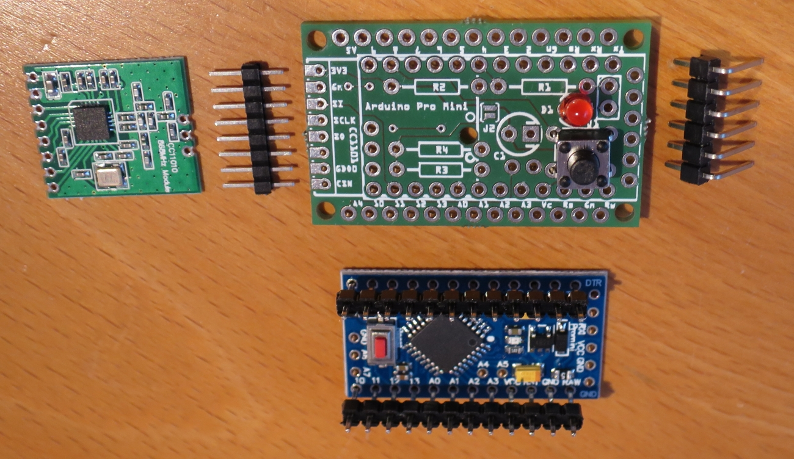
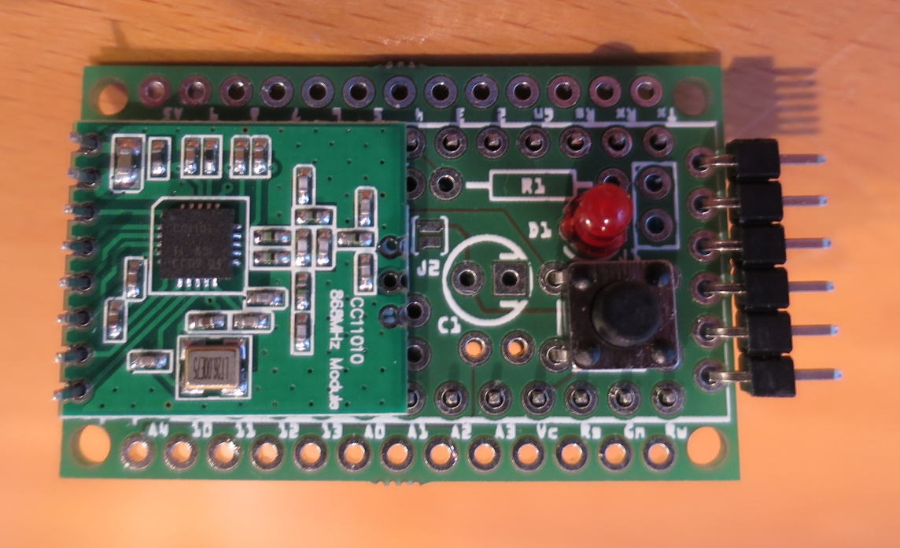
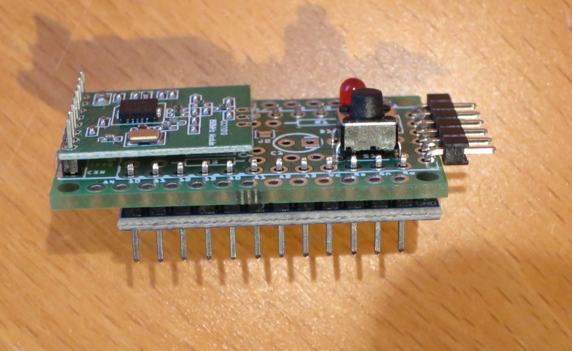
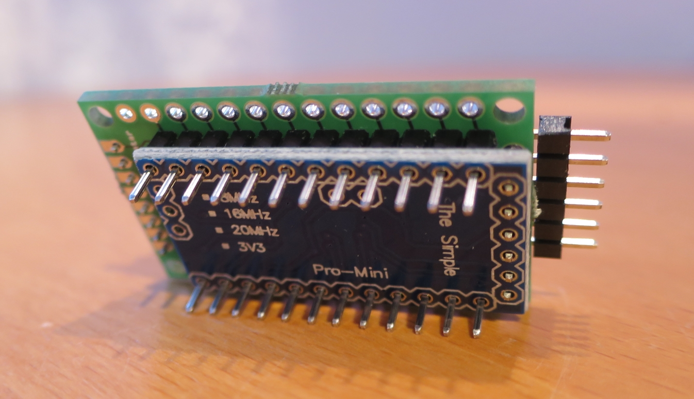
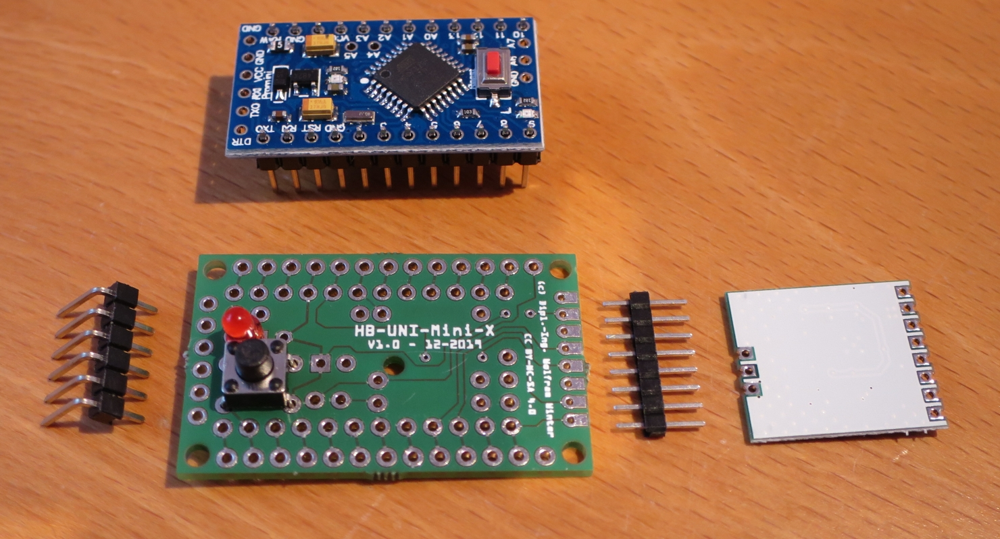
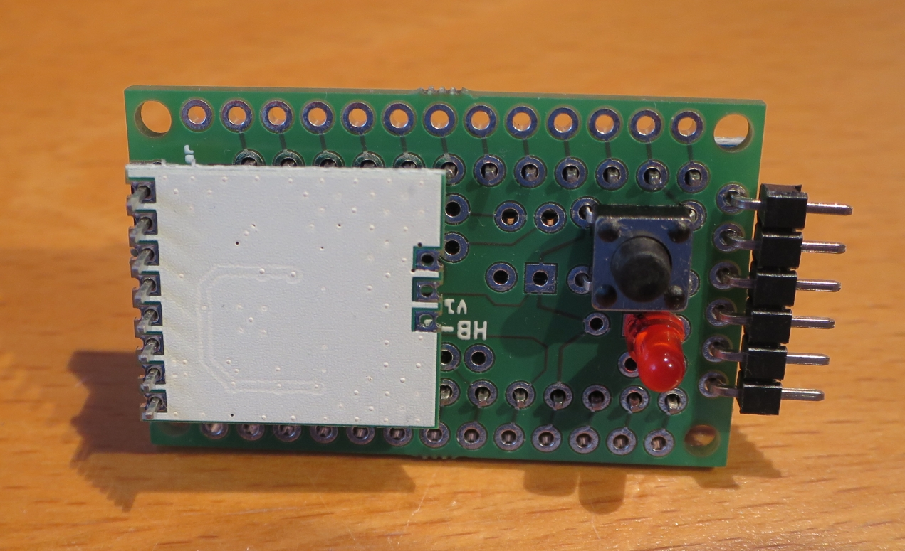
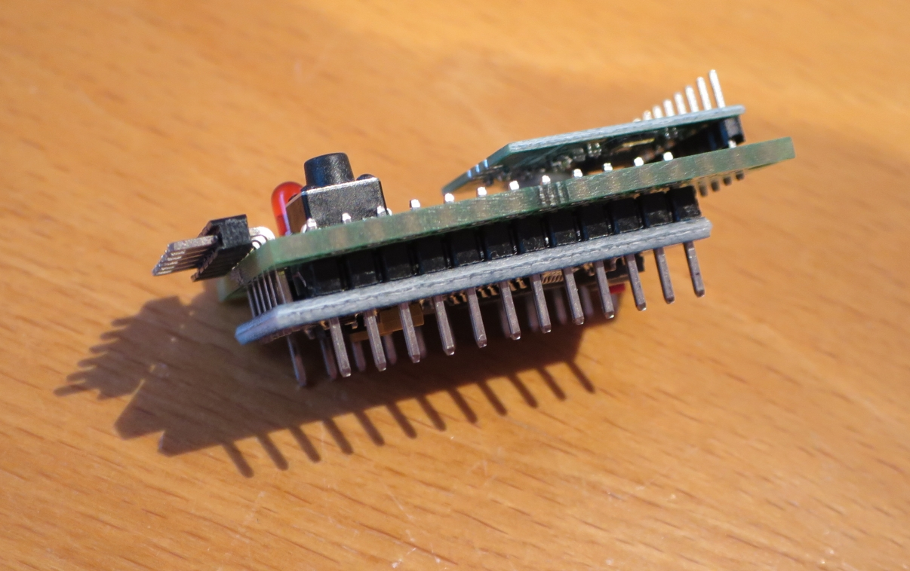
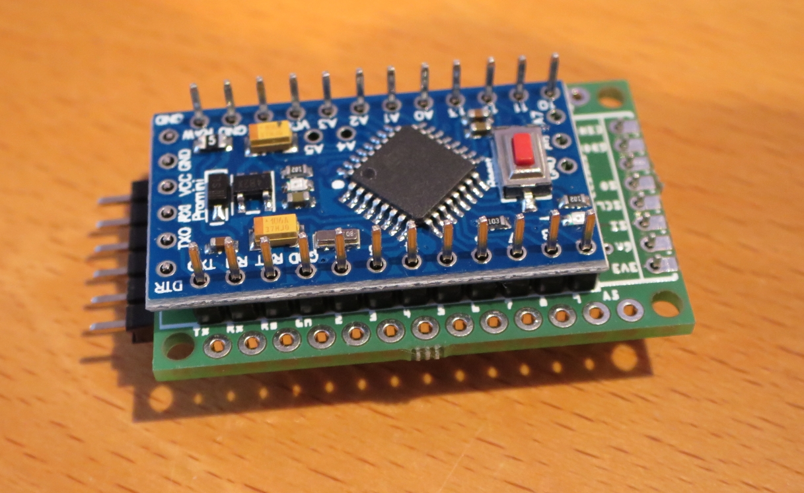

# WW-myPCB - HB-UNI-Mini-X

[Zurück zur Übersicht ...](../README.md)

#### Beschreibung

Universielle 'AskSin++' Mini-Platine.

#### Platine
- Version: 1.0
- Maße: 40 x 25 mm
- Oberseite:
    

  
- Unterseite:
    

  

#### Gerber-Dateien
[Download ...](./bin/Gerber_HB-UNI-Mini-X_1.0.zip)

#### Schaltplan
[Zeigen ...](./bin/HB-UNI-Mini-X_1.0.pdf)

#### Teileliste
[Zeigen ...](./bin/HB-UNI-Mini-X_1.0_Teileliste.txt)

#### Aufbau
- Bestückung der Platine entsprechend der Teileliste:
  - zuerst die diskreten Bauelemente, dann der vorbereitete 'Arduino Pro Mini' (siehe unten) und zuletzt das Sendemodul CC1101
  - in der Regel wird die Platine mit zwei Stiftleisten von oben auf den Arduino gesetzt - auf die Platine kommt dann wiederum das Sendemodul (Variante 1 - minimale Bauhöhe ca. 14 mm)
  - es ist jedoch auch möglich den Arduino oben auf die Platine zu setzen - dabei werden dann S1, D1 und J1 von unten auf die Platine gelötet
  -
- Optionale Komponenten = zusätzliche Bestückung:
  - Status-LED
    - Bestückung mit D1, R1 und Jumper J1 - um Strom zu sparen, kann der Jumper nach dem 'Anlernen' für die 'Produktion' entfernt werden
  - Anschluß von 1-Wire Komponenten
    - Bestückung mit R2
  - Anschluß von I2C Komponenten, die Pullup Widerstände benötigen
    - Bestückung mit R3, R4 und Löt-Jumper J2 (gesetzt)
  - Spannungsstabilisierung
    - Bestückung mit C1

#### Bilder
- Zusammenbau Variante 1 (default)  

- Zusammenbau Variante 2  

#### Historie
- 2020-01-10 - Erstveröffentlichung
  - Version 1.0 - 12-2019
