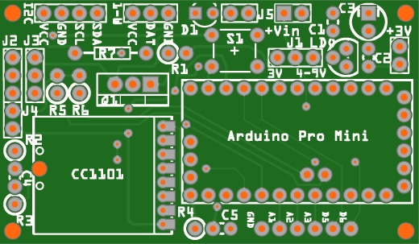
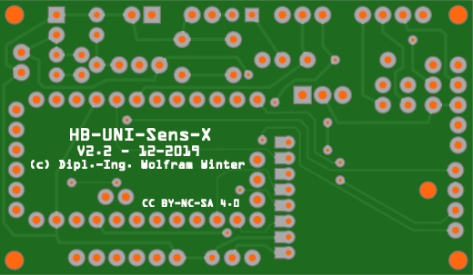

# WW-myPCB - HB-UNI-Sens-X

[Zurück zur Übersicht ...](../README.md)

#### Beschreibung

Universielle 'AskSin++' Platine mit verschiedenen Sensor Anschluß- und Konfigurationsmöglichkeiten.

#### Platine
- Version: 2.2
- Maße: 60 x 35 mm
- Oberseite:
    

  
- Unterseite:
    

  

#### Gerber-Dateien
[Download ...](./bin/Gerber_HB-UNI-Sens-X_1.1.zip)

#### Schaltplan
[Zeigen ...](./bin/HB-UNI-Sens-X_2.2.pdf)

#### Teileliste
[Zeigen ...](./bin/HB-UNI-Sens-X_2.2_Teileliste.txt)

#### Aufbau
- Bestückung der Platine entsprechend der Teileliste.
  - Jumper J2 und J3 in Richtung 'I2C' nach 'oben' setzen (oder Lötbrücke)
  - Jumper J4 bleibt offen
  
- Spannungsversorgung
  - 3 - 3.3 V (max)
    - LDO, C1 und C2 werden <u>nicht</u> bestückt
    - Jumper J1 (links) auf '3V' setzen (oder Lötbrücke)
  - optional 4 - 9 V (max. 12 V)
    - LDO, C1 und C2 werden bestückt
    - Jumper J1 (rechts) auf '4-9V' setzen (oder Lötbrücke)
  - 2-fach Pinheader mit Abgabe von 3 bzw. 3.3 V für Zusatzplatinen - bei der Benutzung des MCP1702 max. 250mA für alle angeschlossenen Platinen und Elemente
  
- Optionale Komponenten = zusätzliche Bestückung:
  - Status-LED
    - Bestückung mit D1, R1 und Jumper J5 - um Strom zu sparen, kann der Jumper nach dem 'Anlernen' für die 'Produktion' entfernt werden
  - Anschluß von 1-Wire Komponenten
    - Bestückung mit R8
  - Anschluß von I2C Komponenten, die Pullup Widerstände benötigen
    - Bestückung mit R5, R6 und Jumper J4 (gesetzt)
  - Spannungsüberwachung per INO-Script
    - Bestückung mit C4, R2 und R3
    - Details dazu auf der 'Github TomMajor' Side - [Zeigen ...](https://github.com/TomMajor/SmartHome/tree/master/HB-UNI-Sensor1#messung-der-batteriespannung)
  - GND-Schaltung (An/Aus) von I2C und / oder 1-Wire Komponneten
    - Bestückung mit Q1
    - über die Jumper J2 (I2C) und J3 (1-Wire) kann gewählt werden, ob eine 'geschaltete' GND-Verbindung für die Komponenten besteht
  
- Vorbereitung des 'Arduino Pro Mini':
  - Hardware
    - zur Minimierung des Ruhestroms müssen auf dem 'Arduino Pro Mini' Board der LDO Spannungsregler und die <u>drei</u> Signal-LEDs ausgelötet werden
    - Details dazu auf der 'AskSin++' Side - [Zeigen ...](https://asksinpp.de/Grundlagen/01_hardware.html#batteriebetrieb)
      - Anmerkung: die *dritte* Signal-LED befindet sich unten rechts auf der Platine - siehe [-5-]
  - Software
    - Aufspielen des Bootloaders und Setzen der Fuse-Bits
    - Details dazu auf der 'AskSin++' Side - [Zeigen ...](https://asksinpp.de/Grundlagen/FAQ/babbling_idiot.html#anschluss-des-isp)
    -  Aufspielen des INO-Scripts - z.B.:
        - Projekt 'PCB_HB-UNI-Sens-X' - [Zeigen ...](../SHP_HB-UNI-Sens-X/README.md)
        - 'Universalsensor HB-UNI-Sensor1' von 'Github TomMajor' Side' - [Zeigen ...](https://github.com/TomMajor/SmartHome/tree/master/HB-UNI-Sensor1#universalsensor-hb-uni-sensor1)
  
- Gemessener Ruhestrom ohne externe Komponenten
  - mit 2 AA Batterien (=3.2V) ohne LDO-Regelung < 4uA
  - mit 3 AA Batterien (=4.8V) und 3.3V LDO-Regelung <= 7uA

#### Bilder

#### Historie
- 2020-01-10 - Erstveröffentlichung
  - Version 2.2 - 12-2019
