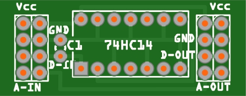

# WW-myPCB - 'Schmitt-Trigger' uni

[Zurück zur Übersicht ...](../README.md)

#### Beschreibung

Oftmals liefern Breakout-Sensor Platinen unpräzise bzw. 'schwingende' Schaltzustände. Mit Hilfe eines 'Schmitt-Triggers' können diese Impulse in klar definierte Rechteck-Impulse umgewandelt werden: der 'Schmitt-Trigger' vergleicht zwei Spannungen und liefert je nach Eingangspegel und Schaltschwelle, einen klar definierten Ausgangszustand. Damit wird aus einem undefinierten Eingangssignal ein definiertes Ausgangssignal. Da der '74HC14' ein invertierender 'Schmitt-Trigger' ist, wird das Ausgangssignal auch noch umgedreht, sodaß aus einem 'High/Low' Eingangsimpuls ein 'Low/High' Ausgangsimpuls wird.

#### Platine
- Version 1.0
- Maße: 38 x 15 mm
- Oberseite:
    

    
- Unterseite:
  

  

#### Gerber-Dateien
[Download 'Schmitt-Trigger uni' ...](./bin/Gerber_PCB_Schmitt-Trigger_74HC14_uni_1.0.zip)

#### Schaltplan
[Zeigen 'Schmitt-Trigger uni' ...](./bin/Schmitt-Trigger_74HC14_uni - 1.0.pdf)
 
[Zeigen 'Schmitt-Trigger uni - Verdrahtung' ...](./bin/Schmitt-Trigger_74HC14_uni - 1.0 -_Verdrahtung.pdf)

#### Teileliste
[Zeigen 'Schmitt-Trigger uni - Teileliste' ...](./bin/Schmitt-Trigger_74HC14_uni_Teileliste.txt)

#### Aufbau
- Bestückung der Platine entsprechend der Teileliste.
- Detaillierte Einsatzmöglichkeiten siehe hier:
    - Projekt 'xxxxx' - [Zeigen ...](https://github.com/wolwin/WW-mySHP/blob/master/SHP_HM-WM55_HM-MOD-Re-8/README.md)

#### Bilder
- Übersicht - 'Schmitt-Trigger uni'   

#### Historie
- 2023-01-05 - Erstveröffentlichung
  - Version 1.0 - 11-2022
