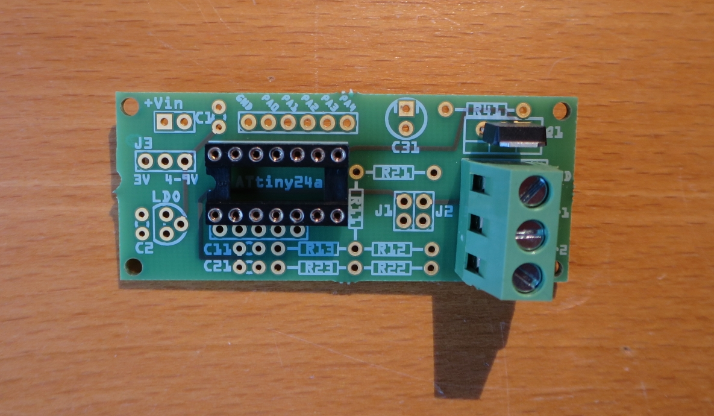

# WW-myPCB - Sens-Gar-118x

[Zurück zur Übersicht ...](../README.md)

### Beschreibung
Sensorplatine für GARDENA 118x Geräte zum Anschluß an ['HB-UNI-Sens-X'](https://github.com/wolwin/WW-myPCB/blob/master/PCB_HB-UNI-Sens-X/README.md) oder ['HB-UNI-Mini-X'](https://github.com/wolwin/WW-myPCB/blob/master/PCB_HB-UNI-Mini-X/README.md). Eine Einbau- bzw. Montagemöglichkeit kann über vier 2 mm Platinen-Löcher realisiert werden.

### Platine
- Version: 1.6
- Maße: 60 x 25 mm
- Oberseite:
    

  
- Unterseite:
    

  

### Gerber-Dateien
[Download ...](./bin/Gerber_Sens-Gar-118x_1.6.zip)

### Schaltplan
[Zeigen ...](./bin/Sens-Gar-118x_1.6.pdf)

### Teileliste
[Zeigen ...](./bin/Sens-Gar-118x_1.6_Teileliste.txt)

### Aufbau
- Bestückung der Platine entsprechend der Teileliste.
  
- Spannungsversorgung
  - 3 - 3.3 V (max)
    - LDO, C1 und C2 werden <u>nicht</u> bestückt
    - Jumper J3 (links) auf '3V' setzen (oder Lötbrücke)
  - optional 4 - 9 V (max. 12 V)
    - LDO, C1 und C2 werden bestückt
    - Jumper J3 (rechts) auf '4-9V' setzen (oder Lötbrücke)
  
- Anschluß-Konfiguration
  - für den Anschluß von GARDENA 118x Geräten bleiben die Jumper J1 und J2 offen (default)
  - wenn ein (potentialfreier) Schalter - statt eines GARDENA 118x Gerätes - angeschlossen werden soll, wird der jeweilige Jumper J1/J2 gesetzt
  - detaillierte Konfigurationsmöglichkeiten siehe hier:
    - Projekt 'SHP_HB-SCI-4-O-Gar118x' - [Zeigen ...](https://github.com/wolwin/WW-mySHP/blob/master/SHP_HB-SCI-4-O-Gar118x/README.md)
  
- Programmierung des 'ATtiny24a' - INO-File siehe hier:
  - Projekt 'SHP_Sens-Gar-118x' - [Zeigen ...](https://github.com/wolwin/WW-mySHP/blob/master/SHP_Sens-Gar-118x/README.md)
  
- Gemessener Ruhestrom ohne externe Komponenten
  - mit 2 AA Batterien (=3.2V) ohne LDO-Regelung < 4uA
  - mit 3 AA Batterien (=4.8V) und 3.3V LDO-Regelung <= 6uA

### Bilder
- Übersicht - 'Sens-Gar-118x'   

### Historie
- 2020-01-10 - Erstveröffentlichung
  - Version 1.6 - 12-2019
