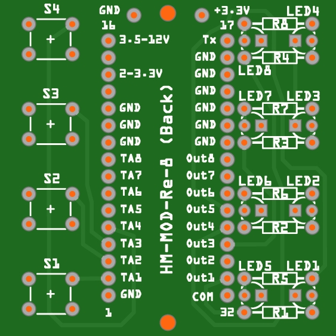
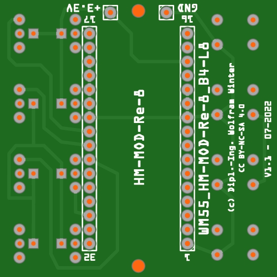
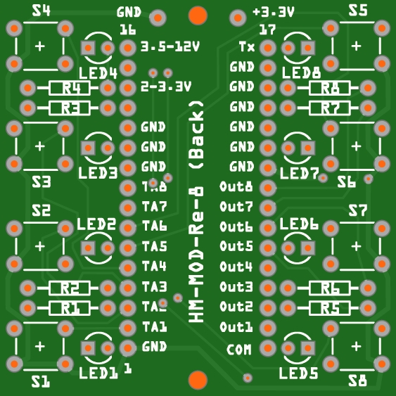
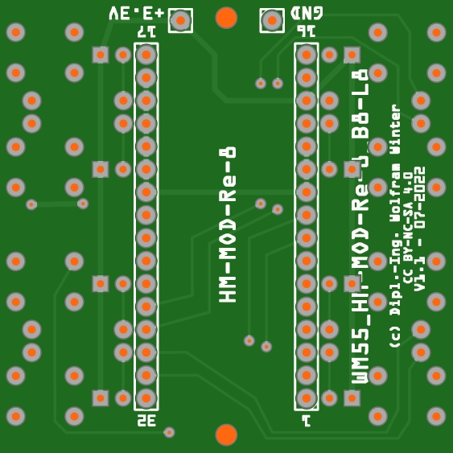
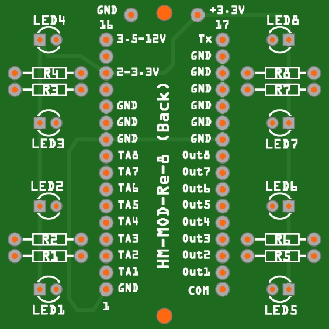
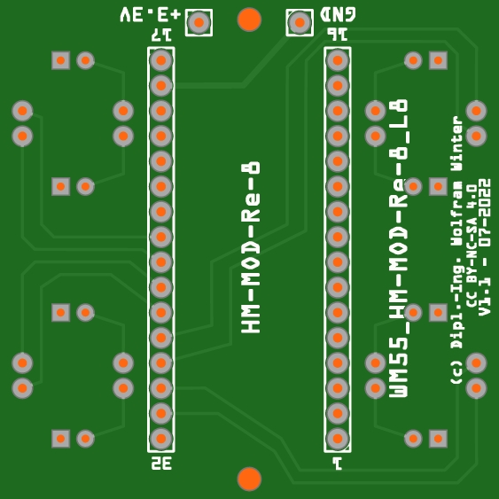
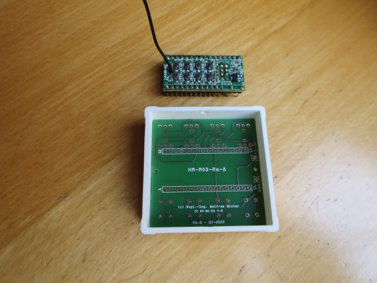
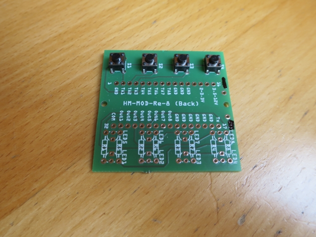
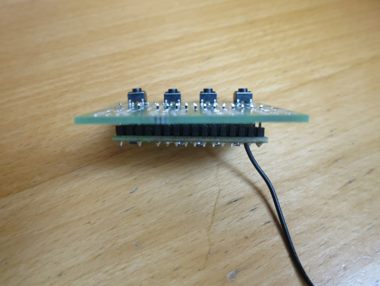

# WW-myPCB - WM55_HM-MOD-Re-8

[Zurück zur Übersicht ...](../README.md)

### Beschreibung
Drei Platinen für den Einbau eines Homematic 8-Kanal-Empfangsmoduls 'HM-MOD-Re-8' in ein WM55-Gehäuse zur Integration in Schalterserien unterschiedlicher Hersteller. Die Platinen bilden die Funktion des 'HM-MOD-Re-8' Moduls mit 'vier Tasten und acht LEDs', mit 'acht Tasten und acht LEDs' und mit 'acht LEDs' ab.

### Platinen
- <b>WM55_HM-MOD-Re-8_B4-L8 - Version 1.1</b>
  - Maße: 50 x 50 mm
  - Oberseite:
      
    
      
  - Unterseite:
      
    
    

- <b>WM55_HM-MOD-Re-8_B8-L8 - Version 1.1</b>
  - Maße: 50 x 50 mm
  - Oberseite:
    
  
    
  - Unterseite:
    
  
    

- <b>WM55_HM-MOD-Re-8_L8 - Version 1.1</b>
  - Maße: 50 x 50 mm
  - Oberseite:
    
  
    
  - Unterseite:
    
  
    

### Gerber-Dateien
[Download 'WM55_HM-MOD-Re-8_B4-L8' ...](./bin/Gerber_WM55_HM-MOD-Re-8_B4-L8_1.1.zip)
 
[Download 'WM55_HM-MOD-Re-8_B8-L8' ...](./bin/Gerber_WM55_HM-MOD-Re-8_B8-L8_1.1.zip)
 
[Download 'WM55_HM-MOD-Re-8_L8' ...](./bin/Gerber_WM55_HM-MOD-Re-8_L8_1.1.zip)

### Schaltplan
[Zeigen 'WM55_HM-MOD-Re-8_B4-L8' ...](./bin/WM55_HM-MOD-Re-8_B4-L8_1.1.pdf)
 
[Zeigen 'WM55_HM-MOD-Re-8_B4-L8 - Verdrahtung' ...](./bin/WM55_HM-MOD-Re-8_B4-L8_1.1_Verdrahtung.pdf)
 
[Zeigen 'WM55_HM-MOD-Re-8_B8-L8' ...](./bin/WM55_HM-MOD-Re-8_B8-L8_1.1.pdf)
 
[Zeigen 'WM55_HM-MOD-Re-8_B8-L8 - Verdrahtung' ...](./bin/WM55_HM-MOD-Re-8_B8-L8_1.1_Verdrahtung.pdf)
 
[Zeigen 'WM55_HM-MOD-Re-8_L8' ...](./bin/WM55_HM-MOD-Re-8_L8_1.1.pdf)
 
[Zeigen 'WM55_HM-MOD-Re-8_L8 - Verdrahtung' ...](./bin/WM55_HM-MOD-Re-8_L8_1.1_Verdrahtung.pdf)

### Teileliste
[Zeigen 'WM55_HM-MOD-Re-8_B4-L8 - Teileliste' ...](./bin/WM55_HM-MOD-Re-8_B4-L8_1.1_Teileliste.txt)
 
[Zeigen 'WM55_HM-MOD-Re-8_B8-L8 - Teileliste' ...](./bin/WM55_HM-MOD-Re-8_B8-L8_1.1_Teileliste.txt)
 
[Zeigen 'WM55_HM-MOD-Re-8_L8 - Teileliste' ...](./bin/WM55_HM-MOD-Re-8_L8_1.1_Teileliste.txt)

### Aufbau
- Bestückung der Platine entsprechend der Teileliste je nach Platine.
- Detaillierte Konfigurationsmöglichkeiten siehe hier:
    - Projekt 'SHP_HM-WM55_HM-MOD-Re-8' - [Zeigen ...](https://github.com/wolwin/WW-mySHP/blob/master/SHP_HM-WM55_HM-MOD-Re-8/README.md)

### Bilder
- Übersicht - 'WM55_HM-MOD-Re-8_B4-L8'   

  

### Historie
- 2022-08-28 - Erstveröffentlichung
  - Version 1.1 - 07-2022
